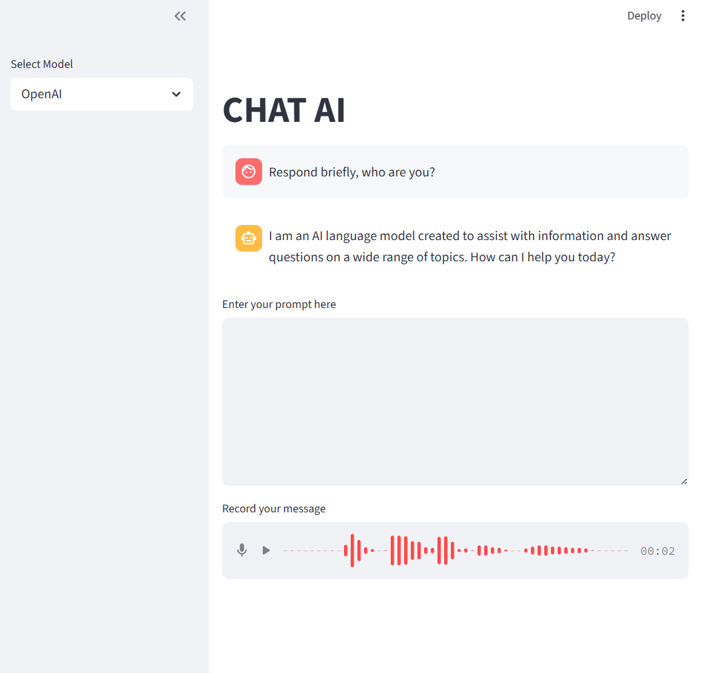

# 🤖 Chat AI - Universal LLM Interface

> A production-ready, multi-provider AI chat application with voice integration and unified API abstraction

[](https://huggingface.co/spaces/NEGU93/chat_ai)


👉 [Try the Chat AI Space](https://huggingface.co/spaces/NEGU93/chat_ai) 🤗

## 🎯 Overview

**Chat AI** is a sophisticated conversational AI platform that abstracts away the complexity of working with multiple Large Language Models (LLMs). Built with modern Python architecture, it provides a unified interface for interacting with various AI providers through a single, elegant web application.



### 🔥 Key Features & Technical Highlights

- **🔄 Multi-Provider Support**: Seamlessly switch between OpenAI GPT, Claude, Gemini, LLAMA, and other models with unified interface abstraction
- **🎙️ Voice Integration**: Speech-to-text capabilities with real-time transcription
- **🏠 Local & Cloud**: Support for both cloud APIs and local inference (OLLAMA, Hugging Face downloading the torch model)
- **🎨 Modern UI**: Clean, responsive interface built with Streamlit
- **⚡ Performance Optimized**: Efficient model loading, caching, and async processing for non-blocking operations
- **🔧 Extensible Architecture**: Modular design with secure environment-based configuration for easy provider addition

> [!TIP]
> Hugging Face implementation downloads and quantizes Torch models directly (optimized for consumer GPUs), using low-level tokenizer encode/decode rather than pipeline methods.

## 🚀 Supported AI Providers

| Provider | Type | Default Model |
|----------|------|----------|
| **OpenAI** | Cloud API | gpt-4o-mini |
| **Claude** | Cloud API | claude-3-7-sonnet-latest |
| **Gemini** | Cloud API | gemini-2.0-flash |
| **OLLAMA** | Local | llama3.2 |
| **Hugging Face** | Local | Meta-Llama-3.1-8B-Instruct |

## 🛠️ Installation & Setup

### Quick Start

```bash
# Clone the repository
git clone https://github.com/NEGU93/chat_ai.git
cd chat_ai

# Install dependencies
pip install -r requirements.txt

# Edit .env with your API keys
```

### Setup keys

Setup whatever keys you want

- For OpenAI, visit https://openai.com/api/
- For Anthropic, visit https://console.anthropic.com/
- For Google, visit https://ai.google.dev/gemini-api
- For HuggingFace, visit https://huggingface.co

> [!NOTE]
> OpenAI key is required for Speech-to-text capabilities

> [!NOTE]
> For the default HuggingFace model, Meta requires you to sign their terms of service. Visit their model instructions page in Hugging Face: https://huggingface.co/meta-llama/Meta-Llama-3.1-8B. It might take some time to validate.

### Environment Configuration

Create a `.env` file in the root directory:

```env
# Cloud API Keys (use only what you need)
OPENAI_API_KEY=sk-proj-...
ANTHROPIC_API_KEY=sk-ant-...
GOOGLE_API_KEY=...
HF_TOKEN=hf_...
```

### Local Setup (OLLAMA)

For local AI models without API costs:

1. Install [OLLAMA](https://ollama.com/)
2. Run the application
3. Enjoy unlimited local AI chat

> [!TIP]
> No need to download the OLLAMA models, my app will download it automatically (just be patient the first time you run)

## 🎮 Usage

```bash
# Start the application
streamlit run app.py
```

Navigate to `http://localhost:8501` and start chatting with your preferred AI model!

## 📊 Why This Project Matters

This application showcases several important technical skills:

- **AI/ML Integration**: Practical experience with multiple LLM providers
- **Software Architecture**: Clean, modular design patterns
- **Full-Stack Development**: Backend AI logic + Frontend web interface
- **API Management**: Secure handling of multiple API integrations
- **Performance Engineering**: Optimization for real-time AI interactions

## 🏗️ Architecture

The application follows a clean architecture pattern with clear separation of concerns:

```
├── models.py          # Implements a unified interface pattern
├── streamlit_app.py   # Web application frontend and user interaction
├── requirements.txt   # Python dependencies (soon)
└── .env               # Environment configuration (API keys)
```

---

**Built with ❤️ by NEGU93** | [GitHub](https://github.com/NEGU93) | [Connect on LinkedIn](https://www.linkedin.com/in/jose-agustin-barrachina/)
